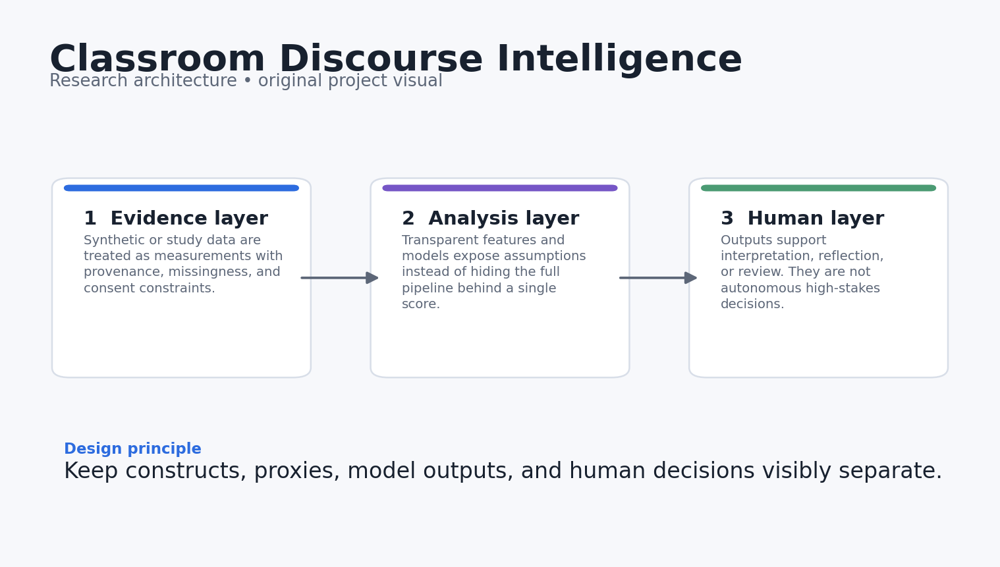
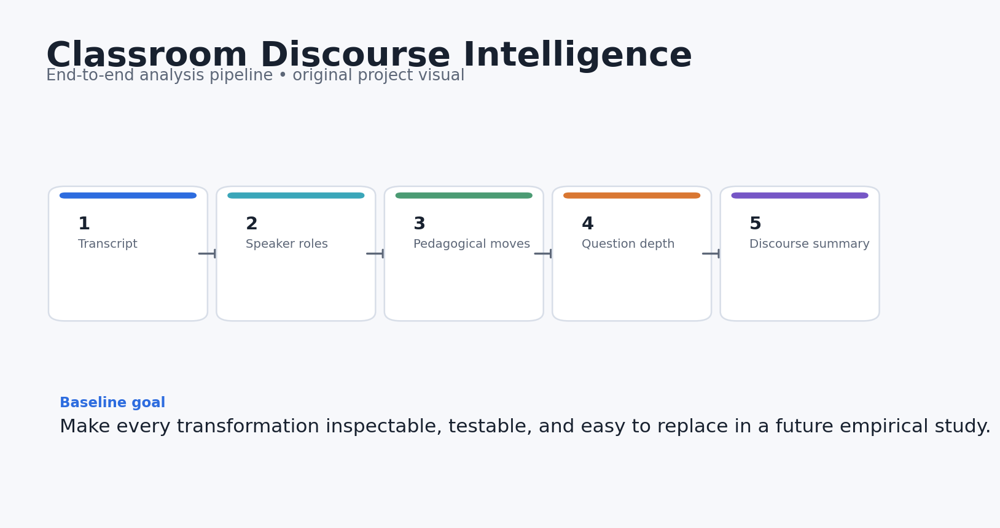
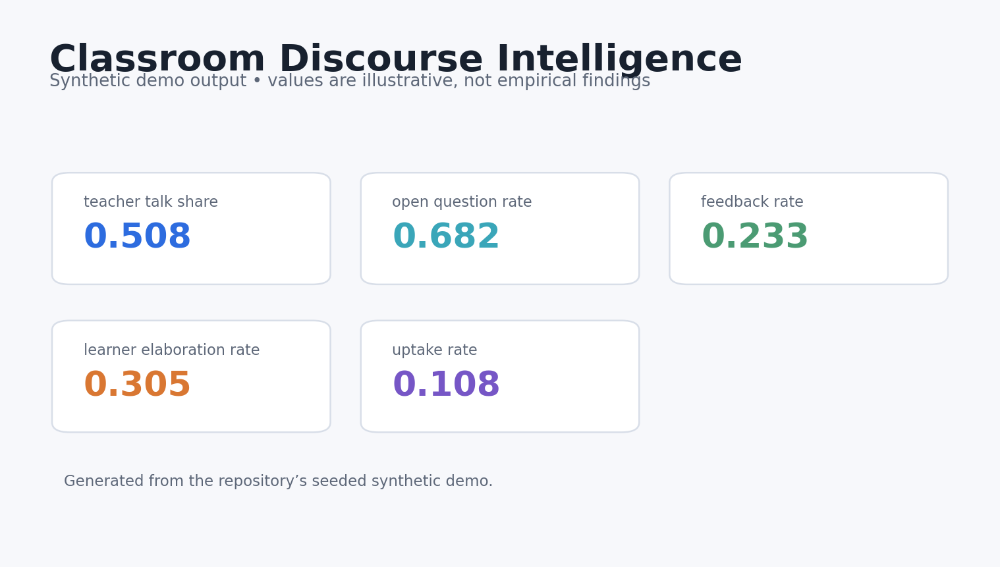
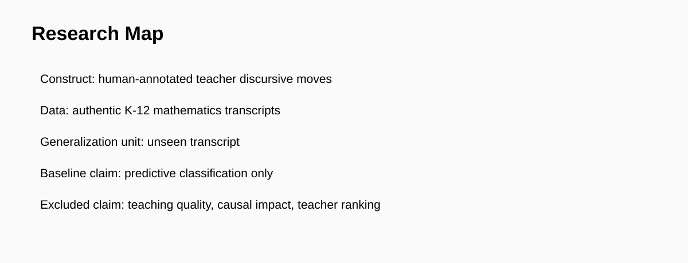

# Classroom Discourse Intelligence

[](https://github.com/devissaputra/classroom_discourse_intelligence/actions/workflows/ci.yml)


**Category:** AI in Education
**Transparent analytics for pedagogical moves, questioning, feedback, and uptake in classroom dialogue.**

> Research prototype. All bundled data and results are synthetic demonstrations. Nothing in this repository should be interpreted as evidence about real learners, teachers, or institutions.



## Why this project exists

Classroom transcripts contain more than word counts. This repo turns them into interpretable discourse features that can support teacher reflection: questioning depth, feedback moves, learner elaboration, and explicit uptake language.

The pipeline keeps speaker roles, pedagogical moves, question depth, feedback, and learner uptake as separate features so classroom summaries remain interpretable and open to review.

## Research questions

1. Which pedagogical moves dominate a lesson segment?
2. How often do questions invite explanation rather than recall?
3. How frequently do teacher feedback, learner elaboration, and uptake moves appear?

## What the repository does



The reference pipeline follows five stages:

1. **Transcript**
2. **Speaker roles**
3. **Pedagogical move tagging**
4. **Question-depth scoring**
5. **Discourse summary**

The baseline is designed for inspection first, with room to add validated discourse models, temporal links, and multimodal evidence later.

## Core outputs

- `teacher_talk_share`
- `open_question_rate`
- `feedback_rate`
- `learner_elaboration_rate`
- `uptake_rate`



The dashboard above is generated from **synthetic data** and is included only to show what the analysis surface looks like. It is not a reported empirical result.

## Quick start

```bash
python -m venv .venv
source .venv/bin/activate  # Windows: .venv\Scripts\activate
pip install -e .[dev]
python examples/demo.py
pytest -q
```

You can also use Docker:

```bash
docker build -t classroom_discourse_intelligence .
docker run --rm classroom_discourse_intelligence
```

## Repository structure

```text
classroom_discourse_intelligence/
├── src/classroom_discourse_intelligence/        # core implementation and synthetic-data generator
├── examples/demo.py        # end-to-end reproducible demo
├── tests/                  # executable unit tests
├── docs/                   # research design, data dictionary, references
│   └── images/             # original project diagrams and demo visualisations
├── results/                # synthetic demo outputs only
├── config/default.yaml
├── Dockerfile
├── Makefile
└── pyproject.toml
```

## Research design in one picture



The fuller design rationale is in [`docs/research_design.md`](docs/research_design.md), including constructs, assumptions, validation steps, and a proposed empirical extension.

## Reproducibility choices

- Synthetic generation uses a fixed random seed.
- The core metrics are implemented as small, testable functions.
- The demo writes machine-readable results into `results/`.
- CI runs the tests on every push and pull request.
- No API keys, proprietary datasets, or external model calls are required for the baseline.

## Responsible-use boundaries

- Text-only transcripts omit gaze, gesture, timing, prosody, and classroom context.
- Move labels are transparent baselines rather than validated teaching-quality scores.
- The intended use is reflective analytics; the system should not be used for automated teacher evaluation.

## Strong next experiments

- Add temporal windows linking teacher moves to subsequent learner elaboration.
- Fuse audio or gaze features only with explicit consent and privacy safeguards.
- Compare transparent rules with a fine-tuned language model and conduct human-centered explanation studies.

## References

See [`docs/references.md`](docs/references.md). The references are there to locate the project in current AIED, learning-analytics, human-centered AI, and instructional-design research. They do **not** imply endorsement or affiliation.

## Citation

If you build on this research prototype, use the metadata in [`CITATION.cff`](CITATION.cff).

## License

MIT for the code in this repository. Research data from future studies should use a separate data-governance and consent process.
