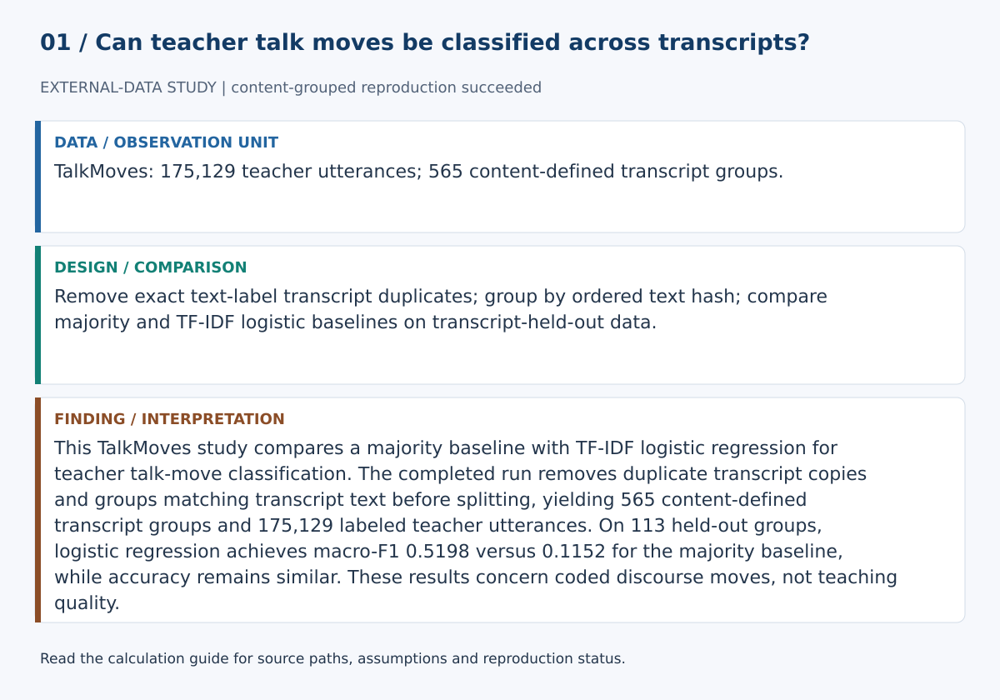
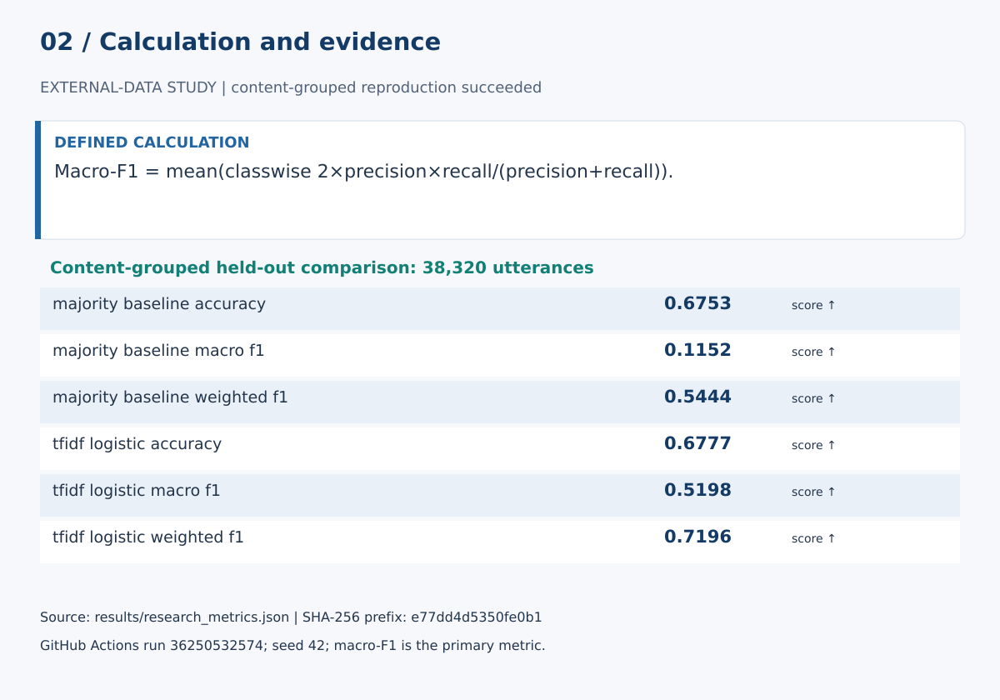

# Classroom Discourse Intelligence —

This repository implements a transcript-held-out TalkMoves study comparing a majority baseline with TF-IDF logistic regression for teacher talk-move classification. The protocol uses macro-F1 to expose minority-class behavior, but its committed empirical metrics currently say regeneration is required, so the study is not presented as completed. A separate synthetic demo illustrates descriptive discourse rules without establishing teacher quality or classroom validity.

## Start here

- [Calculations, evidence and verification scope](CALCULATIONS.md)
- [Figure sources and exact numerical paths](docs/figure_spec.json)
- [Data status](data/README.md)





**Review scope:** The existing suite requires unavailable dependencies; no full-suite pass is claimed. The bundled demonstration executed successfully in this review.

## Detailed project documentation

[](https://github.com/devissaputra/classroom_discourse_intelligence/actions/workflows/ci.yml)

**Research Bundle · AI in Education · real classroom discourse and talk-move classification**

This repository implements an adapter and planned empirical protocol for the **TalkMoves** corpus. The committed metrics are marked `regenerate_required`; no completed TalkMoves experiment is claimed. TalkMoves contains 567 human-annotated K–12 mathematics lesson transcripts derived from real classroom video, with speaker segmentation and sentence-level discursive-move annotations.

The previous synthetic transcript is retained only as a tiny software demonstration. It is not research evidence.

## Research question

> How much signal can a transparent lexical baseline recover for human-annotated **teacher talk moves** when entire transcripts, rather than individual utterances, are held out from training?

A second question is equally important:

> How much does the learned model improve over the training-set majority class when macro-F1, not accuracy alone, is emphasized under class imbalance?

## Why transcript-held-out evaluation

Random utterance splitting can place language from the same classroom transcript in both train and test sets. That can inflate apparent generalization.

This bundle therefore splits at the **transcript level** using a fixed group-aware protocol:
- 64% train transcripts;
- 16% validation transcripts;
- 20% final test transcripts;
- seed 42.

The validation partition is reserved for future model/hyperparameter selection. The current transparent baseline is specified in advance.

## Real dataset

**TalkMoves: K-12 Mathematics Lesson Transcripts Annotated for Teacher and Student Discursive Moves**  
Suresh et al., LREC 2022.

The corpus contains:
- 567 human-annotated lesson transcripts;
- human transcription;
- teacher/student speaker segmentation;
- sentence-level annotations for ten discursive moves across teacher and student discourse.

This research bundle currently benchmarks the **teacher-label subset** using the coding scheme exposed by the official preprocessing notebook.

Dataset license: **CC BY-NC-SA 4.0**. This is a non-commercial research dataset. See [data/README.md](data/README.md).

## Empirical models

### Majority baseline
Always predicts the most frequent teacher-label class in the training set.

### TF-IDF logistic baseline
- word 1–2 grams;
- maximum 50,000 features;
- minimum document frequency 2;
- class-balanced multinomial-capable logistic regression;
- no transcript text from the test partition is used for fitting.

This is intentionally simpler than a Transformer. It creates a credible floor before adding model complexity.

## Evaluation

Primary:
- macro-F1

Secondary:
- weighted-F1
- accuracy
- per-class precision/recall/F1
- confusion matrix
- class support

Macro-F1 is primary because the human talk-move labels are imbalanced.

## Run

```bash
python -m venv .venv
source .venv/bin/activate
pip install -r requirements.txt
python scripts/run_research.py
```

The runner downloads the publicly available TalkMoves archive from the K–12 AI Infrastructure dataset service, caches it locally, extracts the Excel transcripts, reproduces the official teacher-tag normalization, and writes `results/research_metrics.json`.

## Existing descriptive analytics

The original transparent discourse-summary functions remain in `src/classroom_discourse_intelligence/core.py` because they are useful for corpus exploration. They are **not** treated as validated human talk-move classifiers.

## Implemented protocol and pending evidence

- authentic human classroom data;
- human annotation target;
- published dataset and citation;
- non-commercial license boundary;
- transcript-held-out split;
- explicit majority baseline;
- interpretable lexical model;
- imbalance-aware primary metric;
- per-class error analysis;
- reproducible download/cleaning adapter;
- ethics and teacher-evaluation prohibition;
- tests and CI;
- paper-ready research protocol.

See [RESEARCH_BUNDLE.md](RESEARCH_BUNDLE.md).

## Responsible-use boundary

This repository is for research and aggregate discourse analysis. It must **not** be used to rank teachers, make employment decisions, score individual students, or deliver unsupervised evaluative feedback. Talk-move occurrence is not equivalent to teaching quality, and transcript text omits gesture, timing, prosody, classroom history and pedagogical intent.
